>Dive into this walkthrough to learn more about the capabilities of Power BI and the awesome world of control charts.

>**You can find a copy of my Power BI workbook here:** [Google Drive Resources](https://drive.google.com/drive/folders/1F63tmNQSSIaH6dxK_7b0jBsKmMIEAW7_?usp=share_link)
<br>

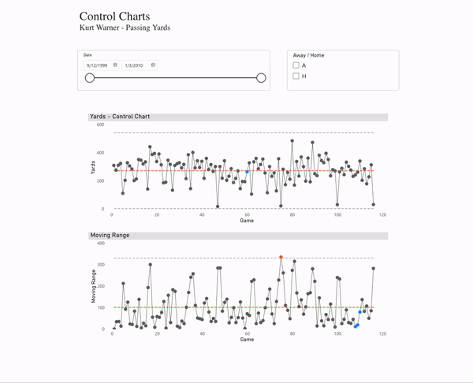

# Introduction

Control charts are a visual tool, common in Lean Six Sigma practices, my team loves to use to track KPIs.

In them, we track what is usually the daily results of a key metric. Below this trend is a moving range chart, measuring the absolute change from the prior day. Hitting targets is great, but being in control and having the ability to move the needle with your actions is even greater. A lot of variation in this moving range could be a sign of not a lot of control over the daily results.

We also include a control line (tracking the average) and control limits as reference lines to understand the normal ranges of the data. These references allow us to flag signals in the data:
- Outlier: a single point is above the Upper Control Limit or below the Lower Control Limit (AKA Rule 1 or Beyond Limits)
- Trend: 7 consecutive points trending up or trending down (AKA Rule 5)
- Shift: 7 or more consecutive points on one side of the average (AKA Rule 4 or Zone C)

There are actually [8 signals](https://www.spcforexcel.com/knowledge/control-chart-basics/control-chart-rules-interpretation/) you can track, but these are the 3 I will highlight.

# Why I'm Writing This

I first learned about control charts from a [great post](https://dataremixed.com/2011/09/tom-brady-and-control-charts-with-tableau/) from Ben Jones in his [DataRemixed blog](https://dataremixed.com). In the post he uses Tom Brady's game stats to introduce control charts and how to build them in Tableau. If you work in Tableau or just want to see some great data work, I highly recommend this post.

I've gotten used to building these in Tableau, but my company recently made the switch to Power BI for our analytics platform. I have really enjoyed learning it so far, but have struggled with control charts.

There are some add-ins you can use that people have published. But most require a license and/or don't have the customization options I am looking for. So, I started researching and testing. There are some great resources available online, but I wanted to build on them to add a few features. It took a lot of time, so I'm sharing this in case it can help anybody with similar needs.

In honor of Ben's post about Tom Brady, I am building this using the stats of one of my favorite quarterbacks: Hall of Famer Kurt Warner.

# Resources

I tend to learn best from reading through different documentation and how-tos and then doing some trial-and-error on my own projects. Here are the resources that really helped me in this build:
- [Towards Data Science Article by Natalie Garces](https://towardsdatascience.com/how-to-create-a-control-chart-in-power-bi-fccc98d3a8f9)
- [Excelerator BI Articel by Matt Allington](https://exceleratorbi.com.au/six-sigma-control-charts-in-power-bi/)
- [Shewhart Individuals Control Chart - Wikipedia](https://en.wikipedia.org/wiki/Shewhart_individuals_control_chart)

I combined the calculation and visualization steps in the articles from Natalie and Matt with the process guidance from Ben and the Wikipedia article to pull this together.

**Data Source:** [Pro Football Reference](https://www.pro-football-reference.com/players/W/WarnKu00/gamelog/)

# Walkthrough

I like when walkthroughs don't spare many details, so I apologize in advance for the long post.

## Optional Data Setup

The following steps are optional depending on how your raw data is structured. In my testing, the simplest method to build these charts is to summarize your data down to one row per timeframe or x-axis instance, for me this is each game.

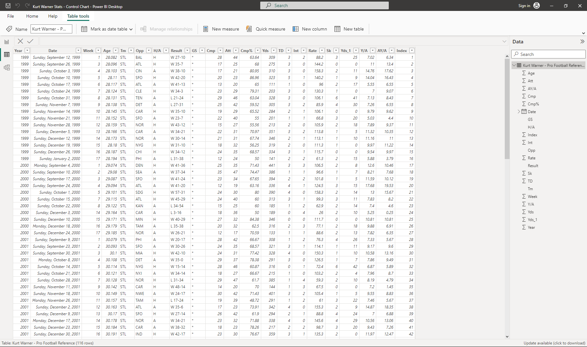

1. Add an Index Row

    If you aren't planning to use a date field for your x-axis, you can add an index in the "Edit Query" window. You can navigate to this by clicking "Transform Data" upon import or right-clicking on your table in the data model view.
    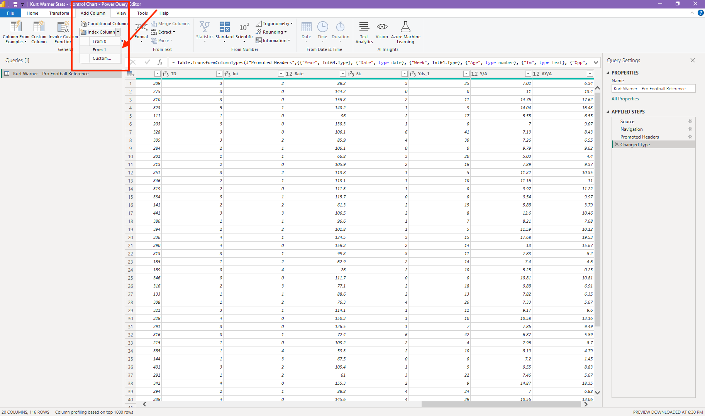

2. Add Calculated Columns

    If you want to plug a metric into your control chart that isn't in your raw data, be sure to calculate it as a column.
    b. If it's a ratio, you could do this after step three, but if it is something like charges - discounts = net sales, you can do that here.

3. Create a Summary Table
    
    This is the step I have found to really simplify the process. Having just one row per x-axis data point allows you to simplify the measures you build, so it does add a step and some storage space, but I have found it well worth it so far. I don't technically need to do it as my NFL data is already one row per game, but I will do it here for the sake of the example.
    
    In the data view, under the Home ribbon, click "New Table" and adapt this code to fit your needs:

    ```
    summary_table = 
    SUMMARIZECOLUMNS (
        'Kurt Warner - Pro Football Reference'[Index],
        'Kurt Warner - Pro Football Reference'[Date],
        'Kurt Warner - Pro Football Reference'[Opp],
        'Kurt Warner - Pro Football Reference'[H/A],
        --[ADD MORE SUMMARIZE COLUMNS HERE],
        --FILTER('Kurt Warner - Pro Football Reference', 'Kurt Warner - Pro Football Reference'[H/A] = "H"), --can add filter here
        "Yards", SUM('Kurt Warner - Pro Football Reference'[Yds]) --expression to return grouped yards
    )
    ```
<br>

---

<br>

If you do want to track a calculated ratio, you could add it to this summarized table to make it a clean metric per day, or game in my example. As you can see in my formula, I am going to keep things simple and just pull over the yards stat to visualize.

**Here is my summarized table:**


## Add New Columns

These are the columns necessary to drive our control chart calculations.

1. Prior Period Amount
    ```
    Prior Game Yards = 
        CALCULATE(
            SUM(summary_table[Yards]),
            FILTER('summary_table',summary_table[Index]=EARLIER(summary_table[Index])-1) --filter to prior index value to grab value
        )

    //Using the calculate and filter functions to drill down to the prior day/game value.
    ```
<br>

2. Moving Range
    ```
    Moving Range = 
        if(summary_table[Index]<=1,0, --ignore the first record
        ABS(summary_table[Yards]-summary_table[Prior Game Yards])
    )

    //calculate the absolute difference between the current game and the prior game yards
    ```
<br>

3. Prior Period Moving Range
    ```
    Prior Game Moving Range = 
        CALCULATE(
            SUM(summary_table[Moving Range]),FILTER('summary_table','summary_table'[Index]=EARLIER('summary_table'[Index])-1)
        )

    //Using the calculate and filter functions to drill down to the prior day/game moving range.
    ```
<br>

**Here is my table with these added columns:**

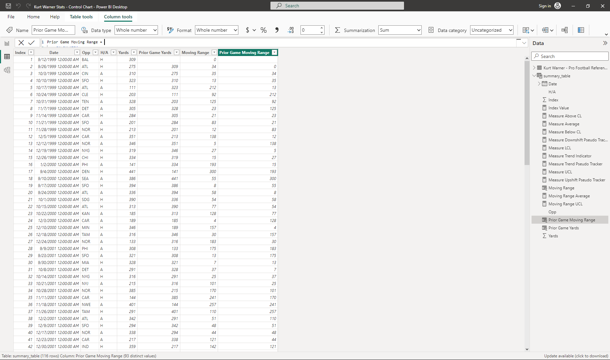

## Calculate Control Chart Measures

With those new fields added, it's now time for a rapid fire of new measures. There are likely ways to combine some of these calculations, but I like to separate each to try to better understand the creation steps. To build out the visualization and signals we've referenced it will take quite a few calculations.

I've added comments to almost all of these to add more context. And for reference, you will see me name anything used for the top "Yards" chart with a "Measure" prefix. Anything for the bottom moving range chart will have a "Moving Range" prefix.

1. Index Value
    ```
    Index Value = 
        CALCULATE(
            MAX('summary_table'[Index]),FILTER('summary_table','summary_table'[Index]='summary_table'[Index])
        )

    //using this as measures are more restrictive in which values/fields you can use to filter.
    ```
<br>

2. Measure Average
    ```
    Measure Average = 
        CALCULATE(
            AVERAGEX('summary_table',summary_table[Yards]),
            ALLSELECTED('summary_table')
        )

    //This is a window average for the control chart stat that will update based on filters.
    ```
<br>

3. Moving Range Average
    ```
    Moving Range Average = 
        CALCULATE(
            AVERAGEX('summary_table',summary_table[Moving Range]),
            ALLSELECTED('summary_table')
    )

    //Window average for our moving range.
    ```
<br>

4. Measure Upper Control Limit (UCL)
    ```
    Measure UCL = [Measure Average] + 3*[Moving Range Average]/1.128

    //Calculate the upper control limit using Shewhart's standards
    ```
<br>

5. Measure Lower Control Limit (LCL)
    ````
    Measure LCL = [Measure Average] - 3*[Moving Range Average]/1.128

    //Calculate the lower control limit using Shewhart's standards
    ````
<br>

6. Measure Trend Indicator
    ```
    Measure Trend Indicator = 
        IF([Index Value] <= 1,0,
        IF(sum(summary_table[Yards])-sum(summary_table[Prior Game Yards])>0,1,
        IF(sum(summary_table[Yards])-sum(summary_table[Prior Game Yards])<0,-1,
        0)))

    //check the direction in which the measure moved from the prior day. Flag as 1=up, -1=down, 0=same
    ```
<br>

7. Measure Trend Pseudo Tracker
    ````
    Measure Trend Pseudo Tracker = 
        VAR CurrentIndex = CALCULATE(max('summary_table'[Index]),FILTER('summary_table','summary_table'[Index]='summary_table'[Index]))
        VAR CurrentTrend = CALCULATE([Measure Trend Indicator],FILTER('summary_table','summary_table'[Index]='summary_table'[Index]))
        RETURN
        CALCULATE (
            COUNTROWS('summary_table'),
            FILTER (
                ALLSELECTED('summary_table'),
                'summary_table'[Index] > CurrentIndex - 7
                && 'summary_table'[Index] <= CurrentIndex
                && [Measure Trend Indicator] = CurrentTrend
            )
        )

    //count up the values in the previous six rows that match the direction of the trend on the current row. If it's 7 (including that row) that's a pseudo 7 day trend even if it isn't a true running count.
    ````
<br>

8. Measure Above Control Line (CL)
    ```
    Measure Above CL = if(sum(summary_table[Yards])>[Measure Average],1,0)

    //Flag with a 1 if the value is above the control line
    ```
<br>

9. Measure Upshift Pseudo Tracker
    ```
    Measure Upshift Pseudo Tracker = 
        IF(
        [Measure Above CL]=0, 0,
        VAR CurrentIndex = CALCULATE(MAX('summary_table'[Index]),FILTER('summary_table',summary_table[Index]=summary_table[Index]))
        RETURN
            CALCULATE(
                COUNTROWS('summary_table'),
                FILTER(
                    ALLSELECTED('summary_table'),
                    summary_table[Index] > CurrentIndex-7
                    && summary_table[Index] <= CurrentIndex
                    && [Measure Above CL] = 1
                )
            )
        )

    //Count the rows in the 7 rows up to the current rows that are above the Control Line (Window Avg). If it is 7 that is a pseudo 7-days in a row, equally an upshift.
    ```
<br>

10. Measure Below Control Line (CL)
    ```
    Measure Below CL = if(sum(summary_table[Yards])<[Measure Average],1,0)

    //Flag with a 1 if the value is below the control line
    ```
<br>

11. Measure Downshift Pseudo Tracker
    ```
    Measure Downshift Pseudo Tracker = 
        IF(
        [Measure Below CL]=0, 0,
        VAR CurrentIndex = CALCULATE(MAX('summary_table'[Index]),FILTER('summary_table',summary_table[Index]=summary_table[Index]))
        RETURN
            CALCULATE(
                COUNTROWS('summary_table'),
                FILTER(
                    ALLSELECTED('summary_table'),
                    summary_table[Index] > CurrentIndex-7
                    && summary_table[Index] <= CurrentIndex
                    && [Measure Below CL] = 1
                )
            )
        )

    //Count the rows in the 7 rows up to the current rows that are below the Control Line (Window Avg). If it is 7 that is a psuedo 7-days in a row, equally a downshift.
    ```
<br>

**Blogger's Note:**

I want to add some context on the pseudo measures. I first tried building out table columns that worked as a running count, resetting to 0 each time the data didn't meet the trend or the shift, but ran into a few challenges. So, I instead built out what I call pseudo measures to represent a running count without actually doing it. 

A trend or a shift signal relies on 7 records in a row meeting specific criteria. By counting up the time in the last 7 records a rule is met, we know anytime the result is 7 means it happend 7 times in a row, even if we didn't have a running count. So our signal calculations I'll share in a little bit will rely on checking if these values = 7 or not.

## Calculate Moving Range Measures

This will have most of the same elements, but aimed at the moving range measures and chart.

1. Moving Range Upper Control Limit (UCL)
    ```
    Moving Range UCL = 3.267*[Moving Range Average]

    //Calculate the upper control limit using Shewhart's standards
    ```
<br>

2. Moving Range Trend Indicator
    ```
    Moving Range Trend Indicator = 
        IF([Index Value] <= 1,0,
        IF(sum(summary_table[Moving Range])-sum(summary_table[Prior Game Moving Range])>0,1,
        IF(sum(summary_table[Moving Range])-sum(summary_table[Prior Game Moving Range])<0,-1,
        0)))

    //check the direction in which the moving range moved from the prior day. Flag as 1=up, -1=down, 0=same
    ```
<br>

3. Moving Range Trend Pseudo Tracker
    ```
    Moving Range Trend Pseudo Tracker = 
        VAR CurrentIndex = CALCULATE(max(summary_table[Index]),FILTER('summary_table',summary_table[Index]=summary_table[Index]))
        VAR CurrentTrend = CALCULATE([Moving Range Trend Indicator],FILTER('summary_table',summary_table[Index]=summary_table[Index]))
        RETURN
        CALCULATE (
            COUNTROWS('summary_table'),
            FILTER (
                ALLSELECTED('summary_table'),
                summary_table[Index] > CurrentIndex - 7
                && summary_table[Index] <= CurrentIndex
                && [Moving Range Trend Indicator] = CurrentTrend
            )
        )

    //count up the values in the last seven days that match the direction of the trend on the current date. If it's 7 that's a psuedo 7 day trend even if it isn't a true running count.
    ```
<br>

4. Moving Range Above CL
    ```
    Moving Range Above CL = IF(sum(summary_table[Moving Range])>[Moving Range Average],1,0)

    //Flag with a 1 if the moving range is above the control line
    ```
<br>

5. Moving Range Upshift Pseudo Tracker
    ```
    Moving Range Upshift Pseudo Tracker = 
        IF(
        [Moving Range Above CL]=0, 0,
        VAR CurrentIndex = CALCULATE(MAX(summary_table[Index]),FILTER('summary_table',summary_table[Index]=summary_table[Index]))
        RETURN
            CALCULATE(
                COUNTROWS('summary_table'),
                FILTER(
                    ALLSELECTED('summary_table'),
                    summary_table[Index] > CurrentIndex-7
                    && summary_table[Index] <= CurrentIndex
                    && [Moving Range Above CL] = 1
                )
            )
        )

    //Count the rows in the 7 days up through the current row date that are above the Control Line (Window Avg). If it is 7 that is a psuedo 7-day trend, even if it isn't a true running count.
    ```
<br>

6. Moving Range Below CL
    ```
    Moving Range Below CL = IF(sum(summary_table[Moving Range])<[Moving Range Average],1,0)

    //Flag with a 1 if the moving range is below the control line
    ```
<br>

7. Moving Range Downshift Pseudo Tracker
    ```
    Moving Range Downshift Pseudo Tracker = 
        IF(
        [Moving Range Below CL]=0, 0,
        VAR CurrentIndex = CALCULATE(MAX(summary_table[Index]),FILTER('summary_table',summary_table[Index]=summary_table[Index]))
        RETURN
            CALCULATE(
                COUNTROWS('summary_table'),
                FILTER(
                    ALLSELECTED('summary_table'),
                    summary_table[Index] > CurrentIndex-7
                    && summary_table[Index] <= CurrentIndex
                    && [Moving Range Below CL] = 1
                )
            )
        )

    //Count the rows in the 7 days up through the current row date that are below the Control Line (Window Avg). If it is 7 that is a pseudo 7-day trend, even if it isn't a true running count.
    ```
<br>

## Calculate Signals

This is my favorite part of these charts, and the reason why we added so many measures. These are visual indicators to help your viewers separate the signals from the noise.

1. Measure Signal

    ```
    Measure Signal = 
        IF(sum(summary_table[Yards]) > [Measure UCL], "Outlier",
        IF(sum(summary_table[Yards]) < [Measure LCL], "Outlier",
        IF([Measure Trend Pseudo Tracker]>=7,"Trend",
        IF([Measure Downshift Pseudo Tracker]>=7,"Shift",
        IF([Measure Upshift Pseudo Tracker]>=7,"Shift",
        "In Range")))))

    //Plug in rules for flagging the Outlier, Trend, and Shift signals
    ```
<br>

2. Measure Signal Description

    ```
    Measure Signal Description = 
        if([Measure Signal] = "Outlier", "The value was above the upper control limit or below the lower control limit.",
        if([Measure Signal] = "Trend", "7 values in a row trended in the same direction.",
        if([Measure Signal] = "Shift", "7 values in a row were above the control line or below the control line.",
        if([Measure Signal]= "In Range","The value was within the normal range."))))
    ```
<br>

3. Moving Range Signal

    ```
    Moving Range Signal = 
        if(sum(summary_table[Moving Range]) > [Moving Range UCL], "Outlier",
        if([Moving Range Trend Pseudo Tracker]>=7,"Trend",
        if([Moving Range Upshift Pseudo Tracker]>=7,"Shift",
        if([Moving Range Downshift Pseudo Tracker] >=7,"Shift",
        "In Range"))))
    //Plug in rules for flagging the Outlier, Trend, and Shift signals for our moving range chart
    ```
<br>

4. Moving Range Signal Description

    ```
    Moving Range Signal Description = 
        if([Moving Range Signal] = "Outlier", "The value was above the upper control limit.",
        if([Moving Range Signal] = "Trend", "7 values in a row trended in the same direction.",
        if([Moving Range Signal] = "Shift", "7 values in a row were above the control line or below the control line.",
        if([Moving Range Signal] = "In Range", "The value was within the normal range."))))
    ```
<br>

Phew! That was a lot of measures. Like I said there may be some opportunity to simplify, and I'd love to hear your suggestions so please let me know! But for now, we're setup for creating visuals. :)

Here is a look at all the added measures:

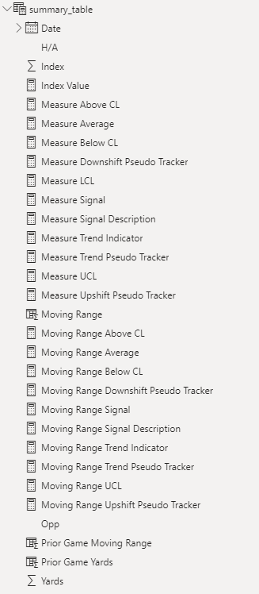

<br>

---

<br>

## Create Control Charts

I want to give a huge shoutout to [Natalie](https://towardsdatascience.com/how-to-create-a-control-chart-in-power-bi-fccc98d3a8f9) here. I used her same methodology of stacking visualizations to get the custom look I want. As of right now, this is the only way I have been able to get this view to work - physically stacking the charts. I'll break it down into a few steps here.

### Measure Reference Lines

In this viz, we will add the window average, LCL, and UCL lines before making the rest of the chart components invisible.

1. Add a line graph to your dashboard.

2. Add the *Measure Average*, *Measure UCL*, and *Measure LCL* field to the Y-axis & the *Index (or date field)* to the X-axis.

    

3. Customize Line Formatting

    You can have a lot of fun with this part. I like to have my UCL and LCL be 1pt width, dashed, in a grey color and my window average to be 2pt width, dashed, with an orange color.

    Here is an example from my average line formatting:
    
    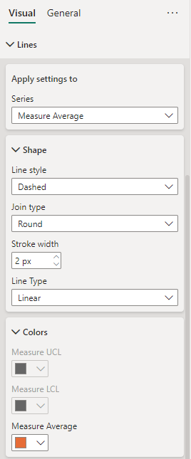


    Your viz should look something similar to this:

    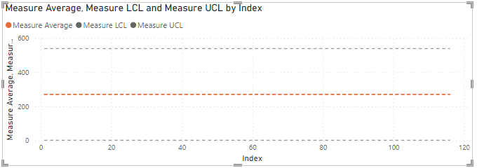

4. Now, because we need to stack 2 charts together, I like to make these changes to really only show the reference lines themselves, but still leave most of the elements to keep sizing consistent:
    - Remove the Legend
    - Change the x-axis & y-axis title and values to white text (make invisible)
    - Remove the gridlines if you want to, I will

    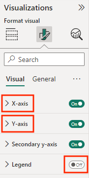

    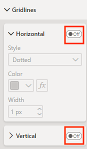    
<br>

Please note, you can also change the chart title settings. What matters most is that the settings match for this and the next chart. I like to simply rename it as "Reference Lines."
 
### Measure Control Chart

The approach here gets a little weird, so bear with me. :) I like to build my control chart with the markers changing colors based on if they are "In Range" or have a signal. To do this, you actually need to start with a bar chart.

1. Add a bar chart to your dashboard

2. Add the "actual" metric to your Y-axis, for me this is *Yards* and the same *Index (or date field)* you used above to the X-axis.

    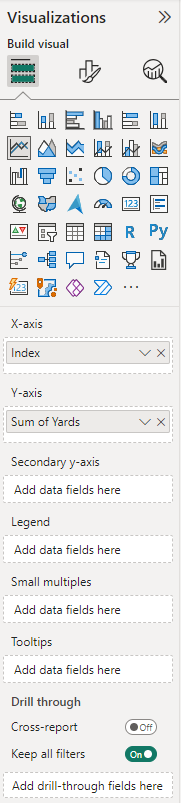

    If you use the raw metric, it will likely show as "Sum of..." You can change this by clicking the down-arrow next to that field in your visualization setting and selecting "Rename for this Visualization."

3. Add a Color Rule - Under the formatting section you should see a sub-section for "Columns". In it, select the "fx" to create some conditional formatting.

    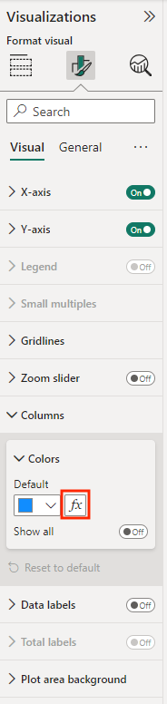

    This should popup a new window where you can:
    - Change "Format style" to **Rules**
    - Change "What field should we base this on?" to **Measure Signal**
    - Add rules until you have four
    - Set colors for the "Outlier", "Trend", "Shift", and "In Range" signals
    - Click "OK"

    

    If your data does have any signals, you should see the bar columns update accordingly:

    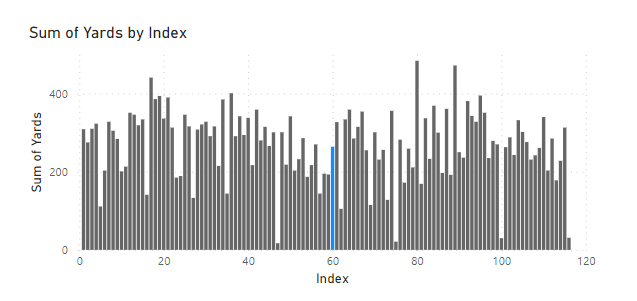

4. With your bar graph selected, navigate to the visualization pane and click on the line chart option to convert the viz to a line chart.

    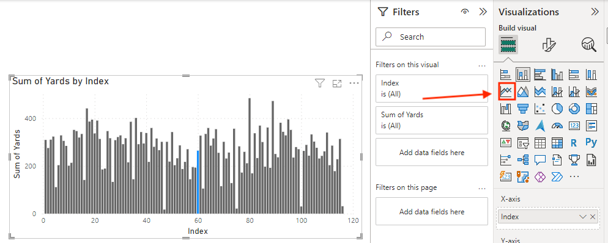

5. Customize Formatting

    With this now as a line graph, it still isn't the prettiest. I like to do some beautification here to make the line a dark grey with a 1pt width. This is less painful on the eyes and helps highlight the signals better. Here is my preferred line formatting:

    

    Unfortunately I haven't found a way to change the marker size here.
<br>

### Bringing These Together

You should now have two line graphs like the ones below, one with reference lines and one with actual results and signals. Now comes the fun of actually stacking them.

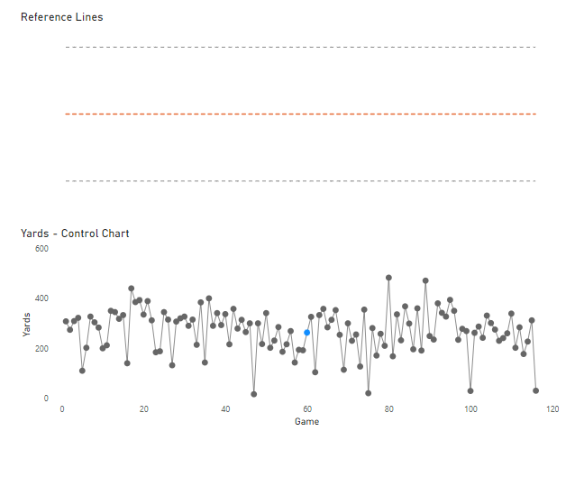

**Blogger's Note**

I really wish I had a more scalable way to do this. I will keep my eye out for other iterations or possibilities, so please reach out if you know of something! I do believe having this on one line graph is possible, but if you want to have the conditional formatting for signals, it applies it to each line and makes it too noisy. So if you don't want to have those signals anyway, you could try the single-chart route to make the reproducibility a bit easier.

1. Synching the y-axis and formatting

    In order to have these stack up correctly your charts need to be the same height and width, and the y-axes need to synch. For now, I've found the best way to do this is by manually fixing them. This does restrict you when new data gets added, so I like to set it with plenty of room above the UCL.

    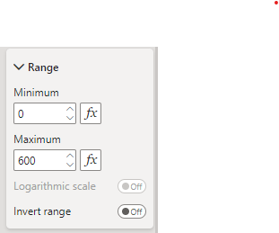

2. Drag the actual trend over top of the reference line chart

    You may need to reorder the objects. If so you can do those under the 'Format' banner:

    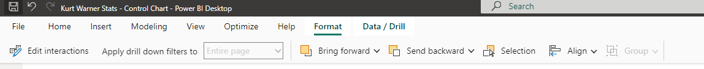

3. Make the top viz (actual control line) background 100% transparent

    You can find this under the 'Format visual - general - effects' pane.

    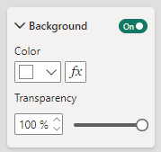

<br>

---

<br>

And voilà!

**Here's my measure control chart:**

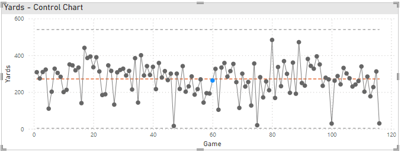

That blue dot signifies a shift, meaning Kurt Warner's passing yards were below his career average for 7 straight games.

We'll get into adding more details via tooltips in a bit. :)

**Blogger's Note:**

I like to add some background color to my title as in the picture above, but I didn't even show the steps because it's pure personal preference. If you want to do the same it is also under the 'Format visual - general - effects' pane.

### Building the Moving Range Control Chart

To build the Moving Range control chart, repeat the steps above to create reference line and actual trend charts. There are only a few differences, so I will only call those out:

1. When creating reference lines, there is no LCL for a moving average so you can just include your *Moving Range Average* and *Moving Range UCL* fields.

    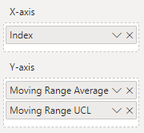

2. When setting your custom formatting for signals, be sure to set the field to base off *Moving Range Signal*

    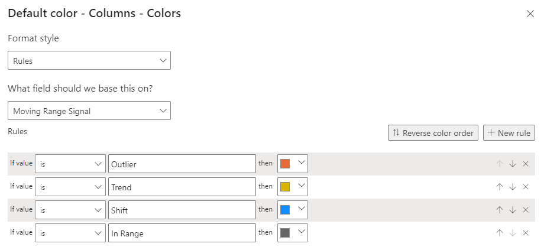

3. When fixing the y-axis for the moving range and reference line:
    - I like to set the minimum to -1 to fully capture any markers at the 0 mark.
<br>

---

<br>

**After applying the same formatting steps, my moving range chart looks like this:**

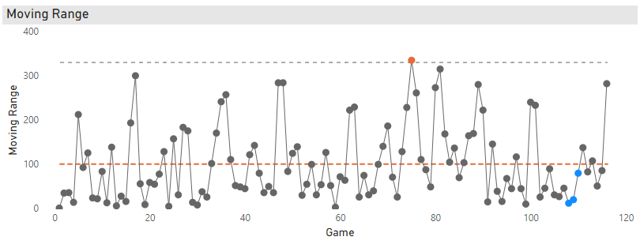

Finally, combining the moving range trend and reference lines, and then moving the vizzes close together will give you this beauty:


There aren't too many signals in this data, but the blue dots on the moving range towards the end of Kurt Warner's career signify a downward shift in game-to-game variability. This means for that 7–9 game stretch Warner had more consistent passing yard performances than he did during his career, on average.

### Adding Tooltips

Adding these details will be a key feature for your users to understand the signals in the data.

I like to add the key control lines, signal title, and description, but you'll also see I added some context on the event itself:

**Measure Control Chart:**

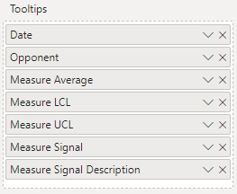

These give you this view when you hover over a data point:

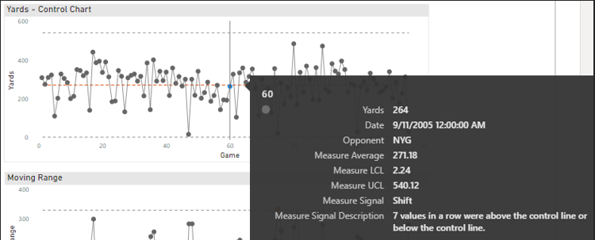

**Moving Range Control Chart:**

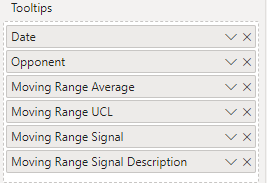

These give you this view when you hover over a data point:

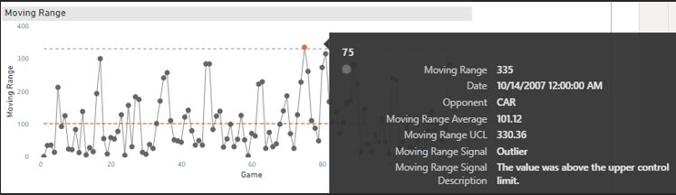

# Conclusion

For finishing touches I like to add some slicers to let the user control for dates and other fields as you saw in the opening .gif. These calculations are built to handle the changes with those sliders to give your users more dynamic insights.


Tools like Power BI and Tableau are great for finding creative solutions to tell the story of your data and information. This is just one way to do it, so I would love to hear more about your use of control charts and Power BI. Thank you for sticking with the long post. I hope the extra detail can help you in your process. In time I want to build out steps to also make the choice of metric more dynamic and share any new tips I find that simplify things, so hopefully more to come.

Cheers,

Brett

    
