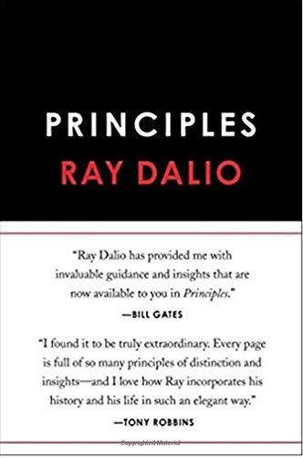

### Currently Reading:

[**_Principles: Life and Work_**](https://www.goodreads.com/book/show/34536546-principles)
\
Ray Dalio
\

### All-time Faves:
- [**_A Thousand Splendid Suns_**](https://www.goodreads.com/book/show/128029.A_Thousand_Splendid_Suns) - Khaled Hosseini
- [**_The Shack_**](https://www.goodreads.com/book/show/1812457.The_Shack) - William Paul Young
- [**_Unbroken: A World War II Story of Survival, Resilience and Redemption_**](https://www.goodreads.com/book/show/8664353-unbroken) - Laura Hillenbrand
- [**_The Book Thief_**](https://www.goodreads.com/book/show/19063.The_Book_Thief) - Markus Zusak
- [**_Sahara_**](https://www.goodreads.com/book/show/41716.Sahara) - Clive Cussler
- [**_The Boys in the Boat: Nine Americans and Their Epic Quest for Gold at the 1936 Berlin Olympics_**](https://www.goodreads.com/book/show/16158509-the-boys-in-the-boat) - Daniel James Brown
- [**_Blue Like Jazz: Nonreligious Thoughts on Christian Spirituality_**](https://www.goodreads.com/book/show/7214.Blue_Like_Jazz) - Donald Miller
- [**_Seeking Allah, Finding Jesus: A Devout Muslim Encounters Christianity_**](https://www.goodreads.com/book/show/18289396-seeking-allah-finding-jesus) - Nabeel Qureshi
- [**_Just Mercy: A Story of Justice and Redemption_**](https://www.goodreads.com/book/show/20342617-just-mercy) - Bryan Stevenson
- [**_Love Does: Discover a Secretly Incredible Life in an Ordinary World_**](https://www.goodreads.com/book/show/13497505-love-does) - Bob Goff

### Full Bookshelf:
Check out my full Goodreads [here!](https://www.goodreads.com/user/show/51852298-brett-dickinson)
